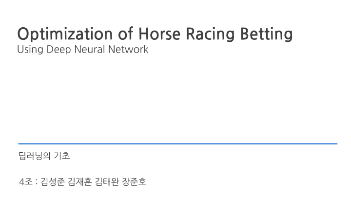
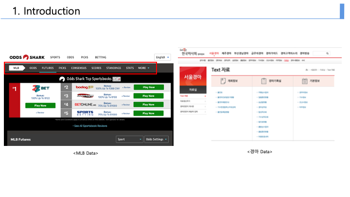
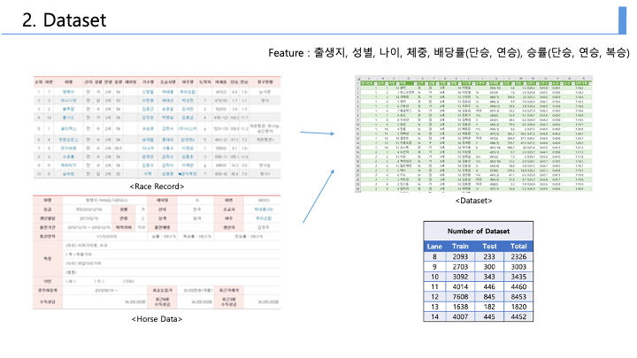
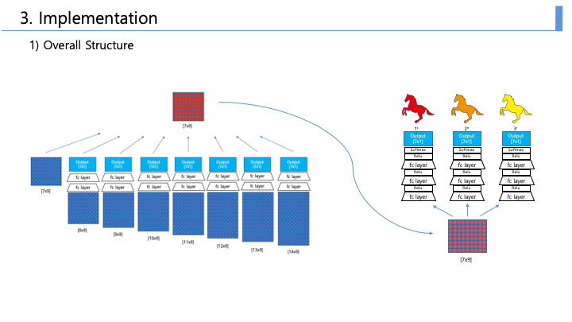
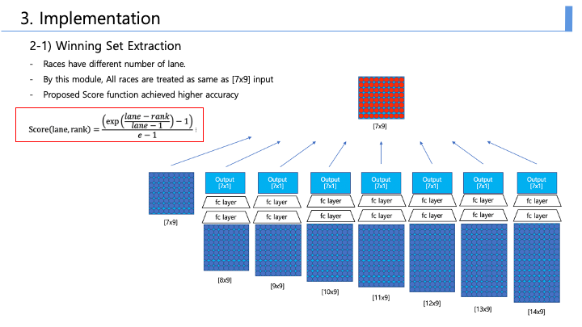
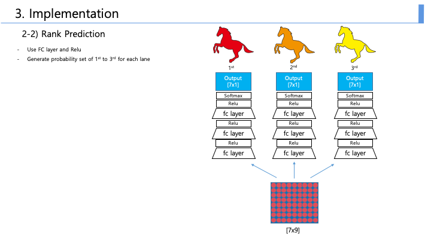
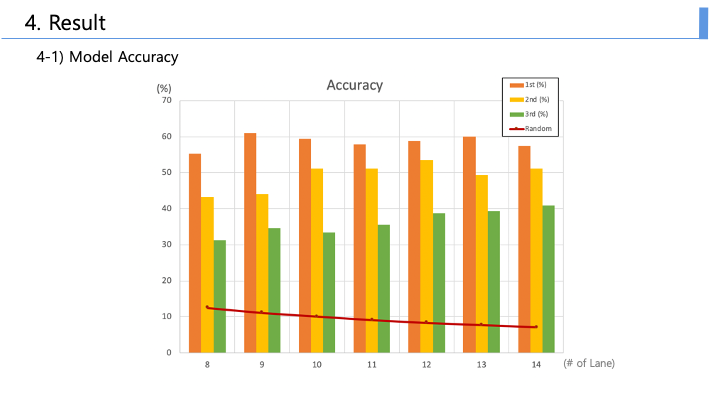
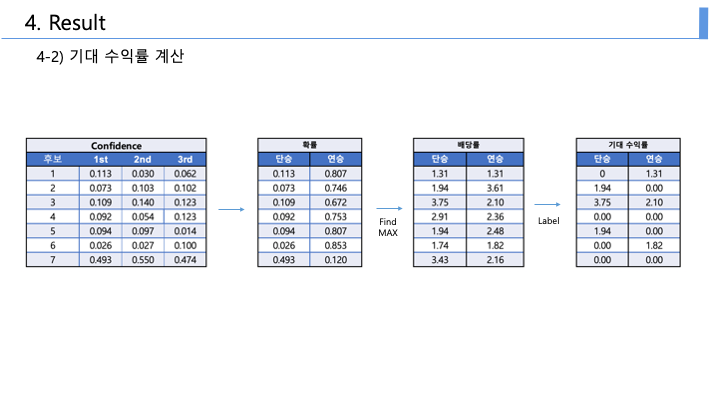
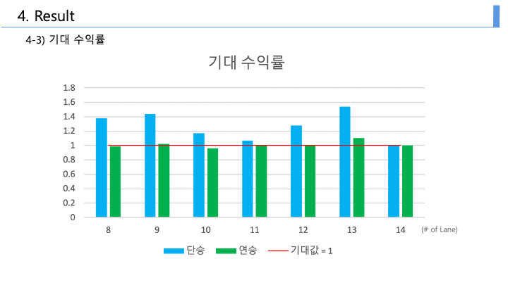

# Horse-Race-Betting-Recommendation-Algorithm
19-2 딥러닝의 기초 기말 프로젝트
________________________________________________

저희 4조에서는 경마 경기를 딥러닝을 이용해 예측하고, 이를 이용해 베팅 수익을 유의미하게 낼 수 있는지 확인해보았습니다.

  스포츠 경기 베팅에서 경마 종목은 상대적으로 베팅 참여자에게 주어지는 정보가 많습니다. 경마를 제외한 다른 스포츠에서는 과거 경기에서의 승률과 상대 전적에 대한 정보 이외에는 수치화 할 수 있는 정보가 주어지지 않습니다. 딥러닝을 이용해 농구, 축구 등의 스포츠 경기 베팅 결과를 예측하려는 기존의 시도에서는 경기 결과에 영향을 주는 유효한 feature가 적었기 때문에 예측에 대한 accuracy가 높지 않았습니다. 

 이러한 Accuracy가 낮은 문제를 극복하기 위해 기존 방법에서는 매번 잃은 돈에 두배를 투자하는 마틴게일 베팅법 등의 베팅 방법에 초점을 맞췄습니다. 하지만 저희 프로젝트에서는 모델 학습에 초점을 맞췄습니다.

 다른 경기 종목에 비해 데이터를 확보하기 좋은 경마의 특성을 활용해 Training Dataset을 확보했고, 경마의 특성을 활용한 새로운 Cost Function의 제안을 통해 높은 Accuracy를 확보했습니다.

  하지만 경마는 다른 스포츠와 달리 경기 결과에 영향을 미치는 정량적인 feature들이 한국 마사회를 통해 공개되어 있습니다. 따라서 유효한 feature를 가진 dataset을 쉽게 구할 수 있는 과제의 특징은 Deep Neural Network를 더 잘 학습시킬 수 있기 때문에 본 프로젝트에서는 경마 게임 결과를 예측하는 Deep Neural Network를 학습시켰습니다. 

 한국마사회 공식 사이트에서 Raw Data를 Crawling했습니다. 서울지역에서 1993 – 2019 시즌동안 열린 약 28000회 경기결과와 참가한 말의 Data를 이용하여 Training 했습니다. Training과 Test에 사용된 경기의 수는 표와 같습니다.

그리고 출생지, 성별, 나이, 체중, 배당률(단승, 연승), 승률(단승, 연승, 복승) 총 9개의 feature를 사용하여 Model을 학습시켰습니다.

경마 경기는 Lane 수에 따라 7개부터 14개의 Lane이 있는 경기로 나뉩니다. 이렇게 Lane별로 경기를 별도로 취급해 Network를 학습시키면 Training에 필요한 충분한 수의 Dataset을 확보할 수 없습니다. 따라서 Network를 크게 2개의 부분으로 분리해서 
모든 종류의 경기 데이터를 하나의 Network를 학습시키는데 사용했습니다. 

서로 다른 Lane의 경기를 하나로 취급해 다음 Network에 전달하기 위해 Winning Set Extraction이라는 모델을 만들었습니다.
Winning Set이란 저희가 정의한 것인데, 7등 이내로 들어올만한 말들의 집합입니다. Lane에 따라 경기를 구분하고 각각 다른 Network를 통해 학습시켰습니다.

경기에 참여하는 말의 가장 적은 수가 7마리이기 때문에 모든 경기에 대해서 7마리를 추출하면, 이후의 Network에서 input크기를 통일할 수 있습니다. 하나의 Network를 학습하는 데 더 많은 데이터를 이용할 수 있으므로 학습이 더 잘 일어나게 하는 효과를 가져왔습니다.

Winning Set을 고르기 위한 Score function은 다음과 같이 설정했습니다.
Exponential 함수를 이용하여 1등에 가까울수록 높은 score를 줘서 model이 높은 등수에 가중치를 두고 학습할 수 있도록 했습니다. 

이 모델에서 기존의 방법과 차별을 둔 점은 
서로 다른 경기를 하나로 취급해 데이터셋의 크기를 늘렸다는 점과
경기 특성에 맞는 Score Function을 제시해 Accuracy를 높였다는 것입니다.

다음 Network는 Rank Prediction Model입니다. 

7마리의 말이 각각 1등할 확률을 구하고
2등, 3등에 대해서도 마찬가지로 각각의 확률을 구합니다.

최종적으로 저희가 구현한 Network에서는 

경기에 참여한 7마리의 말이 1등부터 3등까지를 달성할 확률을 [7x3] Matrix로 출력했습니다.

저희가 구한 확률이 신뢰할 만 하다는 것을 검증하기 위해 1등에서 3등까지의 말을 예측하고 그것에 대한 Accuracy를 보였습니다.

보시는 바와 같이 Random하게 등수를 추측했을 때의 확률인 빨간색 그래프에 비해 충분히 큰 정확성을 보였습니다.

보시는 바와 같이 저희 모델에서 구한 [7x3] 확률 Matrix를 이용해, 각 말을 선택했을 때 Betting에서 승리할 확률을 구했습니다.
이를 바탕으로 승리할 확률이 가장 높은 말을 선택하여, 실제로 Betting 했을 때 수익과 손실을 평균내어 
저희가 구현한 모델을 이용해 베팅을 했을 때 얻을 수 있는 수익의 기댓값을 구했습니다.

보시는 그래프는 저희가 구현한 모델을 이용해 베팅을 했을 때 얻을 수 있는 기대 수익률입니다.
예를 들어, 100만원을 13마리가 달리는 경기의 “단승 종목”에 투자했을 때 약 150만원의 수익을 기대할 수 있게 됩니다. 

위 결과를 통해 딥러닝을 통해 경마 경기에서 베팅 수익을 유의미하게 낼 수 있는지를 검증했습니다.
